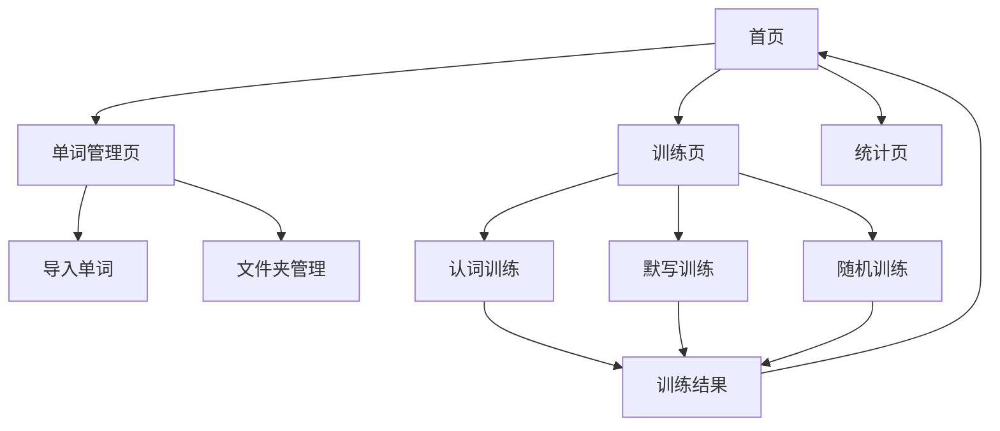

## 1. Product Overview

一个专注于词汇记忆强化的前端应用，支持单词导入、分类管理和多种训练模式。
帮助用户通过科学的记忆方法和多样化的训练方式有效提升词汇量，适配移动端使用。

## 2. Core Features

### 2.1 User Roles
无需用户注册，单机本地使用

### 2.2 Feature Module

词汇记忆应用包含以下核心页面：
1. **首页**: 文件夹列表、训练统计、快速训练入口
2. **单词管理页**: 文件夹管理、单词导入、单词列表展示
3. **训练页**: 多种训练模式、训练统计、答题交互
4. **统计页**: 学习数据统计、进度展示

### 2.3 Page Details

| Page Name | Module Name | Feature description |
|-----------|-------------|---------------------|
| 首页 | 文件夹列表 | 显示所有单词文件夹，显示每个文件夹的单词数量和掌握程度 |
| 首页 | 训练统计 | 显示今日学习单词数、累计学习单词数、正确率等核心数据 |
| 首页 | 快速训练 | 提供一键开始随机训练的入口 |
| 单词管理页 | 文件夹管理 | 创建新文件夹、重命名文件夹、删除文件夹 |
| 单词管理页 | 单词导入 | 支持表格形式导入单词，包含单词、音标、词性、中文释义、英文例句、中文翻译六列 |
| 单词管理页 | 单词列表 | 展示文件夹内所有单词，支持编辑和删除操作 |
| 训练页 | 训练模式选择 | 提供认词训练、默写训练、随机训练等多种模式 |
| 训练页 | 认词训练 | 显示英文单词，用户选择正确的中文释义 |
| 训练页 | 默写训练 | 显示中文释义，用户输入英文单词 |
| 训练页 | 随机训练 | 随机抽取单词进行混合训练 |
| 训练页 | 答题交互 | 显示答题结果，记录正确错误，提供下一题按钮 |
| 训练页 | 训练统计 | 实时显示当前训练的正确数和错误数 |
| 统计页 | 学习数据统计 | 展示各文件夹的学习进度、掌握程度分布 |
| 统计页 | 进度展示 | 图表形式展示学习趋势和记忆曲线 |

## 3. Core Process

用户操作流程：
1. 用户进入首页，查看已有文件夹和训练统计
2. 点击文件夹管理，创建新文件夹并导入单词表格
3. 选择训练模式开始单词记忆训练
4. 系统记录训练结果，更新统计数据
5. 用户可随时查看学习进度和统计报告

## 4. User Interface Design

### 4.1 Design Style
- 主色调：蓝色系（#3B82F6）表示学习和进步
- 辅色调：绿色（#10B981）表示正确，红色（#EF4444）表示错误
- 按钮样式：圆角矩形，移动端友好的触摸尺寸
- 字体：系统默认字体，主要文字14-16px，标题18-20px
- 布局风格：卡片式布局，清晰的信息层级
- 图标风格：使用简洁的线性图标

### 4.2 Page Design Overview

| Page Name | Module Name | UI Elements |
|-----------|-------------|-------------|
| 首页 | 文件夹列表 | 卡片式展示，每个文件夹显示名称、单词数量、掌握程度进度条，使用淡蓝色背景 |
| 首页 | 训练统计 | 顶部展示今日学习数据，使用大号数字和简洁图标，圆角卡片设计 |
| 单词管理页 | 文件夹管理 | 列表形式展示，支持滑动操作，提供新建按钮在页面底部 |
| 单词管理页 | 单词导入 | 拖拽上传区域，支持Excel/CSV格式，显示导入预览表格 |
| 训练页 | 训练模式 | 大按钮网格布局，每个模式配对应图标，清晰的功能描述 |
| 训练页 | 答题界面 | 中央显示题目，底部答题区域，顶部显示进度和统计 |
| 统计页 | 数据图表 | 使用简洁的柱状图和饼图展示学习数据，配合关键数字指标 |

### 4.3 Responsiveness
移动端优先设计，完全适配手机和平板设备。所有交互元素针对触摸操作优化，按钮尺寸不小于44px，支持手势操作。在桌面端保持响应式布局，内容居中显示。