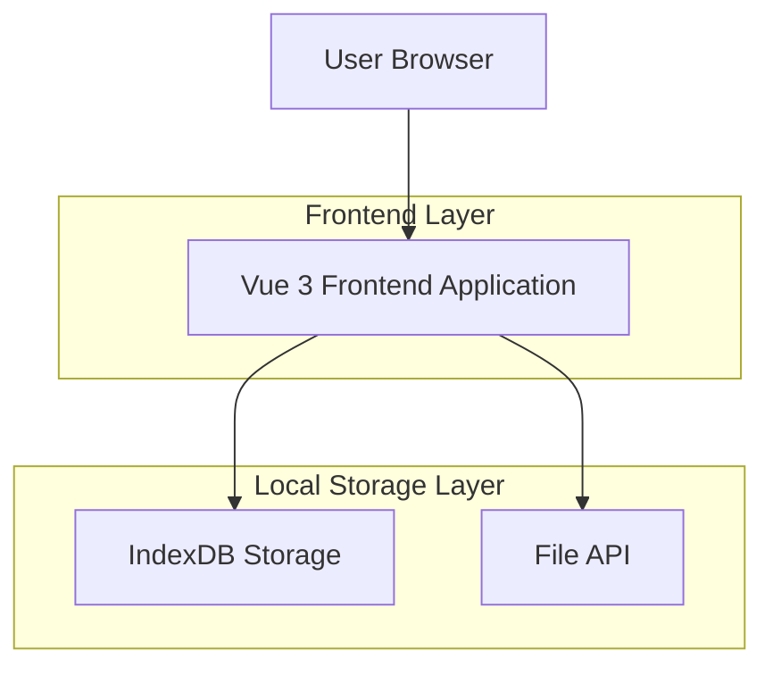

## 1. Architecture design



## 2. Technology Description

* Frontend: Vue 3\@latest + TypeScript\@latest + Vite\@latest

* Initialization Tool: vite-init

* Styling: Tailwind CSS\@3

* Storage: IndexDB (via idb package)

* File Processing: SheetJS (xlsx parsing)

* Mobile UI: @vueuse/gesture (touch gestures)

* Backend: None (纯前端应用)

## 3. Route definitions

| Route             | Purpose          |
| ----------------- | ---------------- |
| /                 | 首页，显示文件夹列表和训练统计  |
| /manage           | 单词管理页，文件夹和单词管理   |
| /train/:mode      | 训练页，mode参数指定训练模式 |
| /stats            | 统计页，显示学习数据统计     |
| /import/:folderId | 单词导入页，向指定文件夹导入单词 |

## 4. Data Model

### 4.1 IndexDB Schema

```typescript
// 文件夹表
interface Folder {
  id: string;
  name: string;
  createdAt: Date;
  updatedAt: Date;
  wordCount: number;
}

// 单词表
interface Word {
  id: string;
  folderId: string;
  word: string;
  phonetic: string;
  pos: string; // 词性
  definition: string; // 中文释义
  example: string; // 英文例句
  translation: string; // 中文翻译
  masteryLevel: number; // 掌握程度 0-5
  lastReviewed: Date;
  reviewCount: number;
  correctCount: number;
  errorCount: number;
}

// 训练记录表
interface TrainingRecord {
  id: string;
  folderId: string;
  mode: 'recognition' | 'dictation' | 'random';
  startTime: Date;
  endTime: Date;
  totalWords: number;
  correctCount: number;
  errorCount: number;
  words: Array<{
    wordId: string;
    isCorrect: boolean;
    userAnswer: string;
    correctAnswer: string;
  }>;
}

// 每日学习统计
interface DailyStats {
  date: string; // YYYY-MM-DD
  wordsLearned: number;
  accuracy: number;
  totalTrainings: number;
}
```

### 4.2 IndexDB 存储结构

```javascript
// 数据库配置
const DB_NAME = 'VocabularyApp';
const DB_VERSION = 1;

// 对象存储空间
const STORES = {
  FOLDERS: 'folders',
  WORDS: 'words',
  TRAINING_RECORDS: 'trainingRecords',
  DAILY_STATS: 'dailyStats'
};

// 索引配置
const INDEXES = {
  WORDS: {
    BY_FOLDER: 'folderId',
    BY_MASTERY: 'masteryLevel',
    BY_LAST_REVIEWED: 'lastReviewed'
  },
  TRAINING_RECORDS: {
    BY_FOLDER: 'folderId',
    BY_DATE: 'startTime'
  }
};
```

## 5. Component Architecture

### 5.1 页面组件结构

```
src/
├── components/
│   ├── common/
│   │   ├── Header.vue
│   │   ├── BottomNav.vue
│   │   └── StatsCard.vue
│   ├── folder/
│   │   ├── FolderList.vue
│   │   ├── FolderItem.vue
│   │   └── FolderEdit.vue
│   ├── word/
│   │   ├── WordList.vue
│   │   ├── WordItem.vue
│   │   ├── WordImport.vue
│   │   └── WordEdit.vue
│   └── training/
│       ├── TrainingMode.vue
│       ├── RecognitionTraining.vue
│       ├── DictationTraining.vue
│       └── TrainingResult.vue
├── views/
│   ├── Home.vue
│   ├── Manage.vue
│   ├── Training.vue
│   ├── Stats.vue
│   └── Import.vue
├── stores/
│   ├── folder.ts
│   ├── word.ts
│   ├── training.ts
│   └── stats.ts
├── utils/
│   ├── indexdb.ts
│   ├── fileParser.ts
│   └── training.ts
└── types/
    ├── folder.d.ts
    ├── word.d.ts
    └── training.d.ts
```

### 5.2 状态管理

使用 Pinia 进行状态管理：

* folderStore: 管理文件夹的CRUD操作

* wordStore: 管理单词的CRUD和查询

* trainingStore: 管理训练状态和记录

* statsStore: 管理统计数据和计算

### 5.3 工具函数

* indexdb.ts: IndexDB 的封装操作

* fileParser.ts: Excel/CSV 文件解析

* training.ts: 训练逻辑和算法

* date.ts: 日期格式化工具

## 6. Mobile Optimization

### 6.1 触摸优化

* 使用 @vueuse/gesture 处理滑动手势

* 按钮最小触摸区域 44x44px

* 支持长按、滑动删除等操作

### 6.2 响应式设计

* 使用 Tailwind CSS 的响应式类

* 移动端优先的断点设计

* 适配各种屏幕尺寸

### 6.3 性能优化

* 组件懒加载

* 虚拟滚动展示长列表

* IndexDB 查询优化

* 图片和图标使用 SVG 格式

